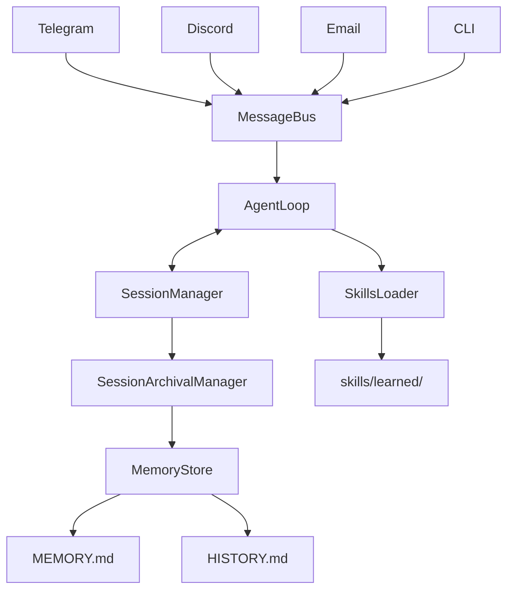
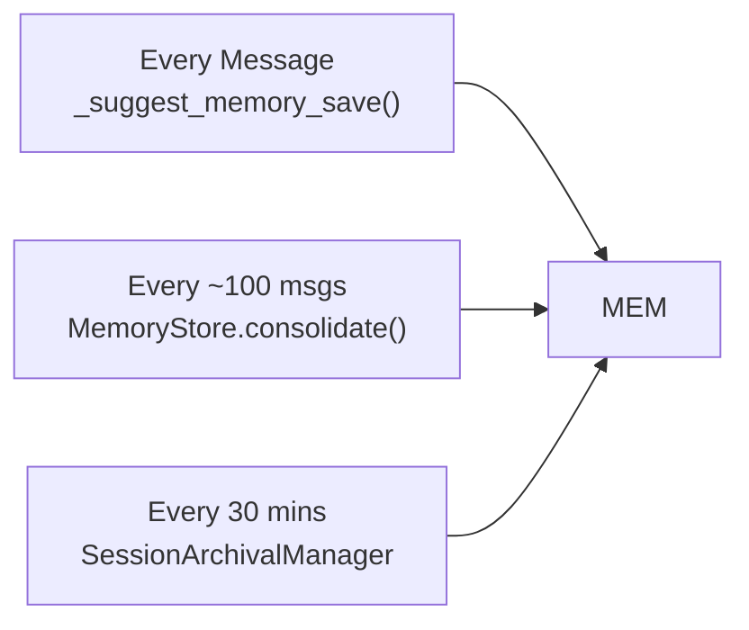
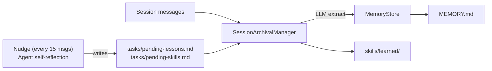
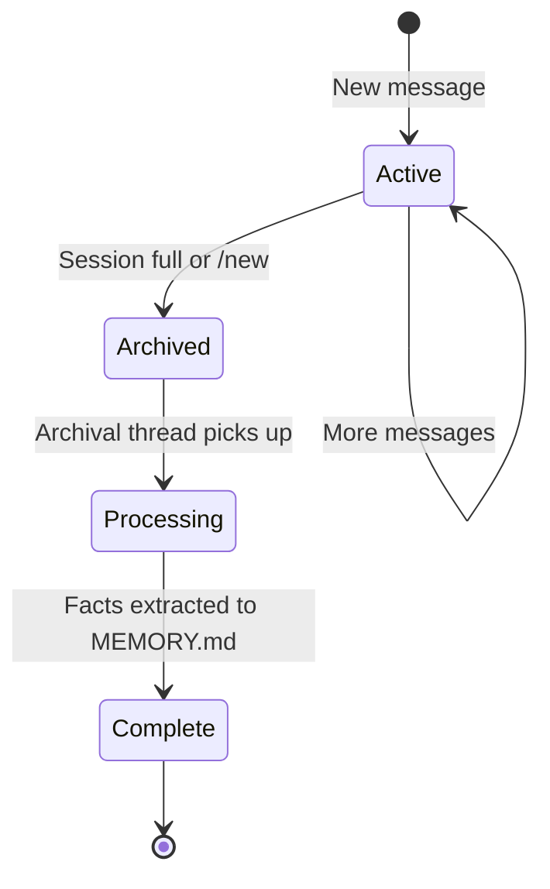
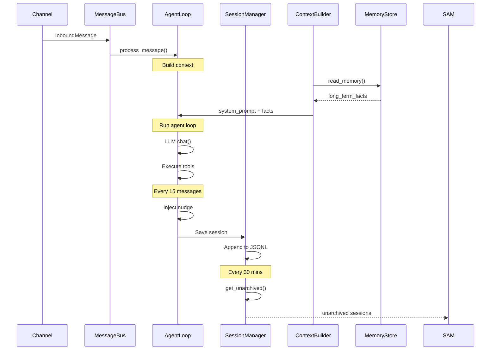
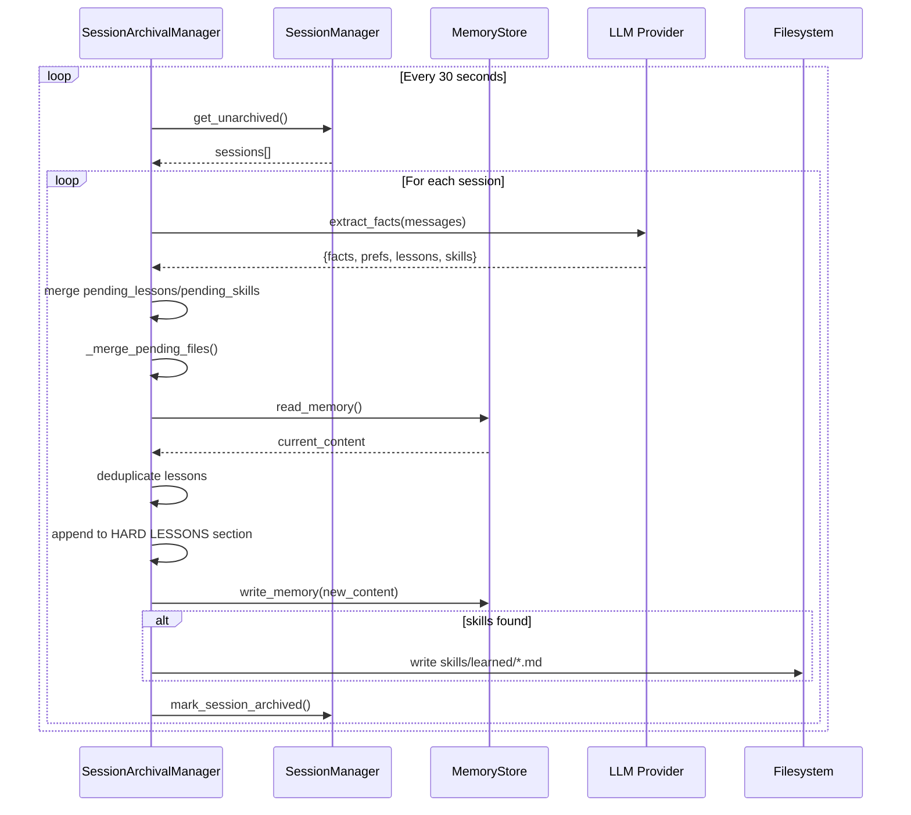
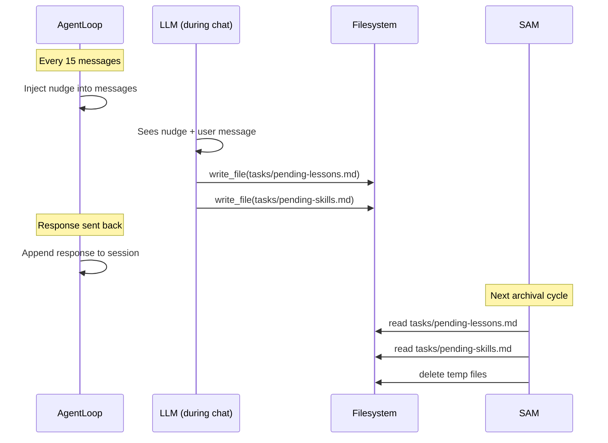

# Sarathy Memory & Skill System Design

## Overview

This document describes the memory and skill system architecture for Sarathy, a personal AI assistant. It covers the design rationale, implementation details, and inspiration from the Hermes Agent Memory System.

---

## Table of Contents

1. [Architecture Overview](#architecture-overview)
2. [Memory System](#memory-system)
3. [Skill System](#skill-system)
4. [Data Flow Diagrams](#data-flow-diagrams)
5. [Design Decisions](#design-decisions)
6. [Inspiration: Hermes Agent Memory](#inspiration-hermes-agent-memory)
7. [File Reference](#file-reference)
8. [Future Extensions](#future-extensions)

---

## Architecture Overview

Sarathy uses a **centralized archival model** for memory management:



**Key Principle**: MEMORY.md has exactly ONE writer (SessionArchivalManager). All other components only read.

---

## Memory System

### Components

| Component | File | Role |
|-----------|------|------|
| `MemoryStore` | `session/memory.py` | Read/write MEMORY.md with smart trimming |
| `SessionArchivalManager` | `session/archival.py` | Background thread, LLM fact extraction |
| `Session` | `session/manager.py` | Holds `pending_lessons`, `pending_skills` |
| `ContextBuilder` | `agent/context.py` | Reads memory for system prompt |

### Memory File Structure

```markdown
# Long-term Memory

## User Profile
<!-- Name, timezone, language, technical level -->

## Preferences
<!-- Tools, response style, workflow preferences learned over time -->

## Project Contexts
<!-- Active projects with key decisions and current state -->

## HARD LESSONS
<!-- Explicit corrections and rules. Start each with "Never" or "Always".
     These are NEVER trimmed — protected from size enforcement. -->

## Standing Instructions
<!-- Persistent behavioral rules the user has explicitly set -->
```

### Three Writers Problem (Before)

The original implementation had THREE simultaneous writers to MEMORY.md:



**Problem**: Race conditions, duplicate writes, inconsistent state.

### Centralized Writer (After)



### Session Lifecycle



---

## Skill System

### Components

| Component | File | Role |
|-----------|------|------|
| `SkillsLoader` | `agent/skills.py` | Discovers and loads skill files |
| `SkillManager` | `agent/skills.py` | Manages skill lifecycle |
| `skills/learned/` | `workspace/skills/learned/` | Auto-extracted workflows |

### Skill File Structure

```markdown
# Skill Name

## Description
Brief description of what this skill does.

## Triggers
When should this skill be used?

## Steps
1. Step one
2. Step two

## Example
```
example usage
```
```

### Skill Types

1. **Template Skills** - Hand-crafted in `sarathy/templates/skills/`
2. **Learned Skills** - Auto-extracted from sessions by archival manager
3. **Dynamic Skills** - Created by agent via `create_skill` tool

---

## Data Flow Diagrams

### Message Processing Flow



### Memory Archival Flow



### Nudge Self-Reflection Flow



---

## Design Decisions

### Decision 1: Single Writer to MEMORY.md

**Problem**: Three writers caused race conditions and duplicates.

**Solution**: SessionArchivalManager is the sole writer. All other components only read.

**Rationale**: Prevents concurrent write conflicts. Archival runs in background thread with 30-second intervals.

### Decision 2: File-Based Nudge Bridge

**Problem**: Agent cannot directly write to Python `session.pending_lessons` list.

**Solution**: Nudge tells agent to write to `tasks/pending-lessons.md`. Archival thread reads and merges.

**Alternative Considered**: Add `track_lesson()` tool. File-based was simpler to implement.

### Decision 3: HARD LESSONS Protected

**Problem**: Smart trimming might accidentally remove important lessons.

**Solution**: `enforce_max_size()` protects sections containing "HARD LESSONS".

**Implementation**: Split content by `## ` sections, preserve HARD LESSONS, trim oldest other sections first.

### Decision 4: Skills Stored Separately

**Problem**: Skills are workflows, not facts. Shouldn't clutter MEMORY.md.

**Solution**: Learned skills written to `workspace/skills/learned/` as individual `.md` files.

**Benefit**: Skills are discoverable via `find_relevant_by_keyword()`. Can be loaded on-demand.

### Decision 5: Session Pending Lists

**Problem**: Nudge output and LLM extraction might duplicate lessons.

**Solution**: `pending_lessons`/`pending_skills` on Session dataclass. Merged with deduplication before write.

**Implementation**: `list(dict.fromkeys(session.pending_lessons + extracted_lessons))`

---

## Inspiration: Hermes Agent Memory

The design is inspired by the [Hermes Agent Memory System](https://hermes-agent.nousresearch.com/docs/user-guide/features/memory), which uses:

### Hermes Principles

1. **Periodic Self-Reflection**: Agent periodically reviews recent exchanges for lessons
2. **Facts vs Skills Separation**: Facts go to memory, skills become reusable workflows
3. **Background Archival**: Non-blocking extraction via background thread
4. **Sectioned Memory**: Fixed sections prevent unbounded growth

### How We Adapted

| Hermes Concept | Our Implementation |
|----------------|-------------------|
| Self-reflection nudge | Every 15 messages, file-based |
| Facts extraction | `SessionArchivalManager._extract_facts()` |
| Lessons (Hermes) | `## HARD LESSONS` section |
| Skills (Hermes) | `workspace/skills/learned/` |
| Conversation logs | `archived_sessions/*.jsonl` |

### Key Differences

1. **Single-file vs Distributed**: Hermes uses multiple memory files; we use single MEMORY.md
2. **LLM Extraction Frequency**: Hermes does continuous; we do 30-second intervals
3. **Skill Creation**: Hermes auto-creates; we review and write via nudge + archival

---

## File Reference

### Memory System Files

```
sarathy/
├── session/
│   ├── memory.py          # MemoryStore class
│   ├── archival.py         # SessionArchivalManager
│   └── manager.py          # Session dataclass with pending_*
└── agent/
    └── context.py          # ContextBuilder reads memory

~/.sarathy/workspace/
├── memory/
│   ├── MEMORY.md          # Long-term facts
│   └── HISTORY.md         # Archived conversation summaries
└── archived_sessions/
    └── session-YYYY-MM-DDTHH-MM.jsonl
```

### Skill System Files

```
sarathy/
├── agent/
│   └── skills.py          # SkillsLoader, SkillManager
└── templates/
    └── skills/            # Template skills
        ├── hello/
        └── remember/

~/.sarathy/workspace/
└── skills/
    └── learned/          # Auto-extracted skills
        └── *.md
```

### Key Classes

#### MemoryStore (`session/memory.py`)

```python
class MemoryStore:
    def __init__(self, workspace: Optional[Path] = None, max_size: int = 2000)

    def read_memory(self) -> str
    def write_memory(self, content: str) -> None
    def get_memory_context(self) -> str  # For system prompt
    def enforce_max_size(self, content: str) -> str  # Smart trimming
    def clean_conversation_logs(self, content: str) -> str
```

#### SessionArchivalManager (`session/archival.py`)

```python
class SessionArchivalManager:
    def __init__(self, config: Config, session_manager, bus=None)
    def start() -> None  # Start background thread
    def stop() -> None

    # Internal
    def _archive_session(session: Session) -> None
    def _update_memory(session, facts, preferences, lessons) -> None
    def _merge_pending_files(lessons, skills) -> tuple
    def _write_learned_skills(session_key, skills) -> None
    async def _extract_facts(messages) -> dict
```

#### Session (`session/manager.py`)

```python
@dataclass
class Session:
    key: str
    messages: list[dict]
    pending_lessons: list[str] = field(default_factory=list)
    pending_skills: list[str] = field(default_factory=list)
    archived: bool = False
```

---

## Future Extensions

### Planned Improvements

1. **Skill Auto-Loading**: `ContextBuilder.build_system_prompt()` should auto-load relevant skills based on current task keywords

2. **Better Trimming**: Currently uses simple line-count. Could use semantic chunking.

3. **History Summarization**: `HISTORY.md` entries could be periodically consolidated into MEMORY.md facts

4. **Lesson Review**: User could review pending lessons before they get written to HARD LESSONS

### Potential Features

1. **Memory Search**: `grep` archived_sessions/ from within agent
2. **Memory Weights**: Some facts more important than others
3. **Memory TTL**: Facts that expire after certain time
4. **Skill Versioning**: Track skill evolution over sessions
5. **Cross-Session Skills**: Skills learned in one context apply to another

---

## Appendix: Nudge Prompt

The periodic self-reflection nudge (injected every 15 messages):

```
[PERIODIC SELF-REFLECTION] Silently review the last 15 exchanges.
Take action only if signal is clear — default is to do nothing.

1. Did Viswa explicitly correct a mistake you made, or set a rule ('never do X', 'always do Y')?
   → Append one bullet per lesson to tasks/pending-lessons.md
   → Format: '- Never/Always <specific rule>'

2. Did you complete a non-obvious multi-step workflow (5+ steps) that is likely to recur?
   → Append one bullet per workflow to tasks/pending-skills.md
   → Format: '- <workflow name>: step1 → step2 → step3'

If nothing significant happened, do nothing.
Do NOT write research results, task outputs, or conversational facts.
```

---

*Last updated: 2025-12-21*
